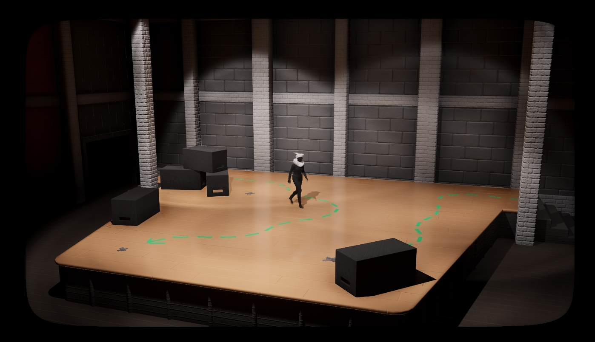
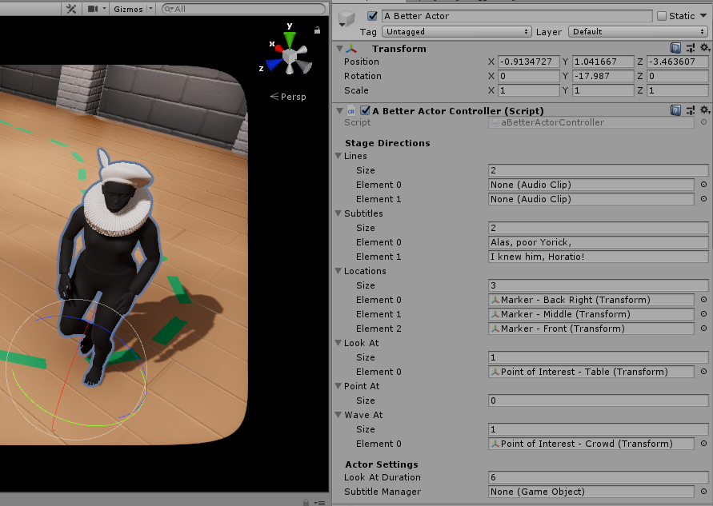
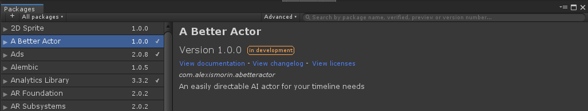
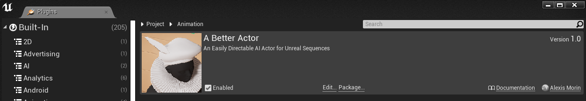

# A Better Actor
## An easily directable AI actor for Unreal & Unity sequences

While real-time engines offer a comparatively modern UX to older DCCs and convenient iteration times, directing actors (as in *acting* actors, not UE4 actors) in a cinematic context is still incredibly tedious, and modern real-time footage or games that offer "unparraleled" cinematic experiences often keep out of frame the clunky, barebones production experience that is matching animation clip offsets and tweaking sequencer timings. If only there was a more streamlined, 1:1 way to do things?

With this engine agnostic package, you can now simply drop your actor (again, *acting* actor, not UE4 actor) into the scene, pipe in some audio & animations from your production database and in a fashion similar to how you would input commands in a game like [NetHack](https://nethackwiki.com/wiki/Commands) (or more relevantly, like you would shout on-set directions to an actor), simplify the directing process to its real-world essence: *walk here, shout that, bow*.

___

### General Use

Upon plugin install, three new prefabs/blueprints are available to you:
- *A Better Actor* Character
- *Actor Position Marker* Location Marker to direct where you actors will walk to.
- *Actor Point of Interest* Point of interest your actor can look at or point at - By default actors are points of interest also.

After dropping the *A Better Actor* prefab/blueprint into the scene, you will need to fill in the following variables for it to work properly:

- (Unreal Only) *Skeletal Mesh*: The skeletal mesh for your actor - assign this as you would for any other blueprint deriving from the character class.
- (Unity Only) *Rig*: The Animator component for your actor - assign this as you would for any other script-animated character.

- *Lines*: Audio clips of your lines that the actor will speak on cue.
- *Subtitles*: Subtitles for the above lines, sent out to the optional *Subtitle Manager* (see below).

- *Locations*: Places (in order) where your actor will walk to throughout the sequence. While this can be any actor/gameobject, the *Actor Position Marker* prefab/blueprint is included for your convenience.
- *Look At*: Things the actor will look at (in order) throughout the sequence. You can leave this empty, and the actor will look at the nearest actor or point of interest nearby.
- *Point At*: Things the actor will point at (in order) throughout the sequence. You can leave this empty, and the actor will point at the nearest actor or point of interest nearby.
- *Wave At*: Things the actor will wave at (in order) throughout the sequence. You can leave this empty, and the actor will wave at the nearest actor or point of interest nearby.

- *Subtitle Manager*: If your actor's lines have subtitles, the text will be piped into this manager via SendMessage (Unity) or Event Dispatcher (Unreal).

If you're using (and realistically you're most probably doing that) a different Skeleton, you can simply duplicate and retarget the included *A Better Actor* [Unity Animator](https://docs.unity3d.com/Manual/Retargeting.html) or [Unreal Animation Blueprint](https://docs.unrealengine.com/en-us/Engine/Animation/RetargetingDifferentSkeletons) and associated animations to your new rig - Note that if you're missing some animations you can always use the royalty-free ones in the package!

Your character set up, it's now only a question of adding them to your Timeline/Sequence, matching them to a Signal (Unity) or Event (Unreal) track and calling the events/signals below. While the plugin is easily extensible, these are the built-in ones included for your convenience:

#### Character Locomotion
- SNEAK: The character will sneak to the next location listed in the *Locations* array.
- WALK: The character will walk to the next location listed in the *Locations* array.
- RUN:  The character will run to the next location listed in the *Locations* array.

#### Dialogue
- WHISPER: The character will whisper the next line in the *Lines* array, adjusting their gait accordingly.
- TALK: The character will say the next line in the *Lines* array, adjusting their gait accordingly.
- SHOUT: The character will shout the next line in the *Lines* array, adjusting their gait accordingly.

#### Body Language
- POINT: The character will point to the next item in the *Point At* array, or the nearest point of interest if the array is empty.
- WAVE: The character will wave to the next item in the *Wave At* array, or the nearest point of interest if the array is empty.
- LOOK: The character will look at the next item in the *Look At* array, or the nearest point of interest if the array is empty.
- BOW: The character will bow at their current location.
- DANCE: The character will dance at their current location.
- CROUCH: The character will crouch, *detective-looking-at-a-clue-on-the-floor* style.

#### Gait Modifiers
- SADDEN: The character will slouch a little and will act a little less lively.
- BRIGHTEN: The character will have a little more pep in their step.
- ANGER: The character will tense up.
- SCARE: The character will start shaking.
- NORMALIZE: The actor will return to a neutral state.

#### Point of Interest Modifiers
- MAKE BORING: The actor will stop being a point of interest. A good use case for this is if you want an actor to point out a specific actor in a crowd.
- MAKE INTERESTING: The actor will start being a point of interest.

___

### Installation - Unity 2019.2.0b1

This is a plugin that makes use of Unity's *Package Manager* feature. Just drop the *com.alexismorin.abetteractor* folder into your *packages* folder (found at the same level as your Assets folder) and it should work out-of-the-box. If you're using a pre-packman version of Unity (ouch), navigate inside the *com.alexismorin.abetteractor* folder and then just drag the *Editor* folder you find there anywhere in your project hierarchy.

### Installation - Unreal 4.22

Installation

___

### Acknowledgements & Thanks

- [e→d films'](https://edfilms.net/) Daniel Gies for having a chat with me and pluging this plugin idea (haha) inside my head.

### TODO

- thing
- thing
- thing

Per usual, whipped up in a few hours - Try and enjoy in spite of the bugs.

